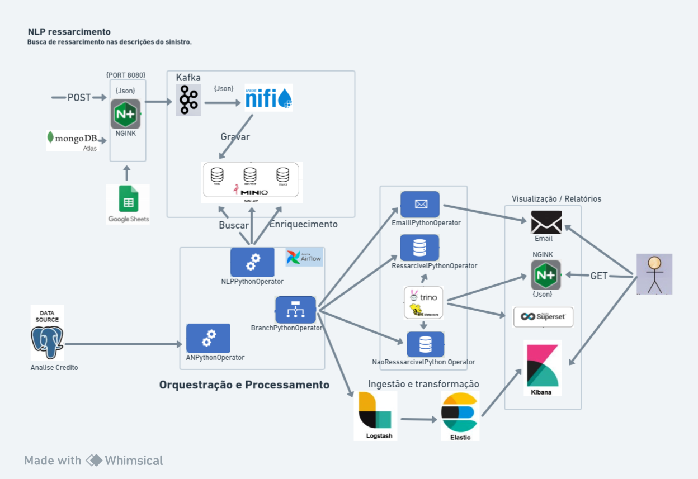
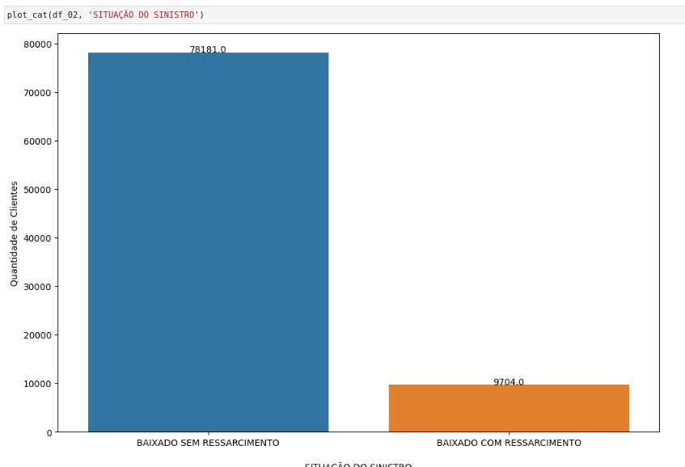
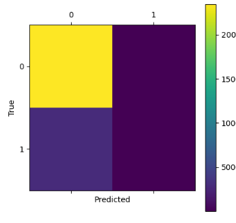
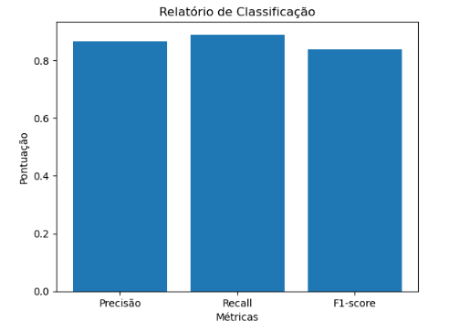
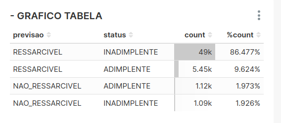
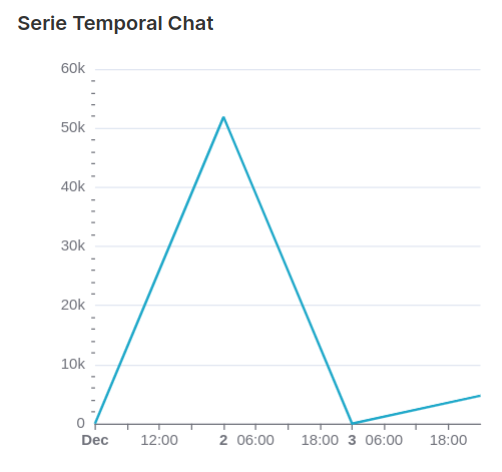

# Projeto-Ressarcimento Sinistro Automóvel

 Busca de ressarcimento do sinistro. Probabilidade de um sinistro ser ressarcível

## 1) Objetivo do Projeto

  Será desenvolvido uma API que aplica o Modelo de Processamento de Linguagem Natural. A partir da descrição do sinistro, será possível identificar quais os  segurados que são culpados pelo sinistro.

  A partir dessa definição, podemos identificar quais segurados se declaram culpados indevidamente. Possibilitando recusa no pagamento do sinistro do terceiro e eventual ressarcimento.

  O Processo de Ressarcimento  que realiza os cálculo da probabilidade de um indivíduo, será otimizado, com isso, teremos  ganhos na tomada de decisão para identificar quando segurado assumiu a culpa de um sinistro e o terceiro poderá ressarcir a Seguradora, utilizando técnicas de NLP (Processamento de Linguagem Natural) 

## 2) Contextualização do Problema
 
  Necessidade do Negócio 
  A área de Sinistro atualmente está encarregada de cuidar das regras de negócio do Ressarcimento. Para otimização do processo, a área de Negócio do Ressarcimento deseja ter mais autonomia no  trabalho de ressarcimento, e para isso precisam de uma solução que permita essa flexibilidade e trate todo o fluxo de dados para o processo de cobrança de ressarcimentos de sinistros.
## 3) Definição Arquitetura

  
 Link whimsical <a href="https://whimsical.com/embed/Ka6hC63hseGXkowtYj6y3z">https://whimsical.com/embed/Ka6hC63hseGXkowtYj6y3z</a>

  
Será desenvolvido uma API que aplica o Modelo de Processamento de Linguagem Natural. A partir da descrição do sinistro, será possível identificar quais os  segurados que são culpados pelo sinistro.:

    · [API] para cálculo da probabilidade gera a requisição no formato json;
    · [Airflow - SinistroPythonOperator] da área do Ressarcimento consulta a base de dados do Sinistro  e gera as requisições no formato json (Intervalo de 3 minutos );
    · [Kafka] recebe essas informações;
    · Spring Boot consome os dados do kafka e gera os arquivos na  pasta do sensor do Airflow; 
    · [Nifi] faz a transformação e envia para [S3 MiniO] na camada RAW;
    · [Airflow – ANPythonOperator] consome os dados da camada RAW, consulta o datasource de Análise de Crédito para verificar se existem restrições e grava na camada CONTEXT; 
    · [Airflow - NLPPythonOperator] consome os dados da camada CONTEXT, aplica o processo de NLP com cálculo da probabilidade de um indivíduo, que assumiu a culpa de um sinistro e o terceiro ressarcir a Seguradora em um dado período e grava na camada TRUST; 
    · Trilha de auditoria/log sendo processado pelo [Logstash];
    · [Logstash] fazendo a ingestão e transformação dos dados para o [Elasticsearch];
    · Visualização dentro do [kibana];
    · [Airflow RessarcivelPythonOperator/NaoRessarcivelPythonOperator] ler a camada TRUST e grava na base do Trino com as informações (RESSARCIVEL OU NAO RESSARCIVEL) e Cria a tabela e Insere/Atualiza Dados no BD;
    · [Airflow EmailPythonOperator] Verifica se o seguro pode ser ressarcível, mandando o e-mail de alerta ou informativo );
    · Com o UUID (Universally Unique Identifier (Identificador Universalmente Único)), podemos consultar cada requisição pela API [FastAPI]
    · Entrega  dos relatórios pelo [Kibana] e [Superset];
       

 ## 4) Descrição das camadas

 ## 5) Base de Dados (Sinistro Automóvel)

 ### 5.12) Base de Dados (Analise de Crédito)

 ## 6) Análise Exploratória

 ### 6.1) Matriz de confusão
 

 ### 6.2) Relatório de Classificação
 

## 7) Amostragem do teste

 ## 8) Dashboards Superset

## 9) IMAGEM DOCKER 

Airflow,
Kafka,
Nifi,
Minio,
FastApiApp,
Jupyter,
Pgadmin,
Postgres,
Logstash,
Superset,
Elasticsearch e 
Kibana

 ##### 9.1 ) Build do pipeline  `build.sh`.

 ##### 9.2 ) Iniciar o pipeline `bash up.sh`

  ##### 9.3 ) Então podemos conectar o seguinte respectivamente:
- Apache-Airflow: http://localhost:8080
- MinIO Console: http://localhost:9001
- Jupyter: http://localhost:8888/
- Kafka API: http://localhost:8091/kafka_producer/docs
- API de Ressarcimento Sinistro Automóvel: http://localhost:8005/docs
- PGAmin: http://localhost:5050
- Superset: http://localhost:8088/superset
- Nifi http://localhost:8443/nifi/ (Importar o template /nifi-flow-templates/pipeline_ressarcimento_v1.xml )

## Contato
Se você tiver alguma dúvida ou quiser entrar em contato, pode enviar um e-mail para: <renatodias08@gmail.com>  OR [linkedin](https://www.linkedin.com/in/renato-dias-santos-687b52102/)
